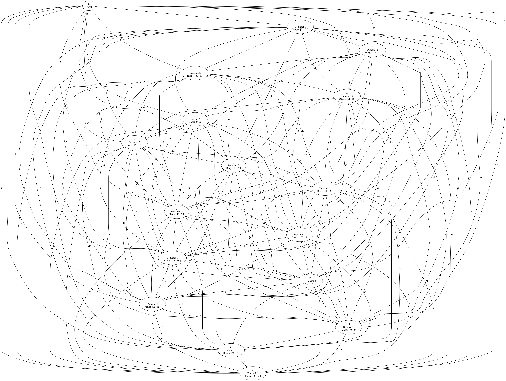

# Capacitated Vehicle Routing Problem with Time Windows (CVRPTW) solver

Capacitated Vehicle Routing Problem with Time Windows (CVRPTW) solver written in Python.

Implementation is based on ["Vehicle Routing Problem with Time Windows" section in Google OR-Tools documentation](https://developers.google.com/optimization/routing/cvrptw).


## Overview

This program solves Capacitated Vehicle Routing Problem with Time Windows (CVRPTW).

For example, given the following network and three vehicles at the depot (node 0) to pick up all demands on all nodes in as short a time period as possible,



the program provides the solution like the following:


## Prerequisites

Python 3.9 or later is required.


## Usage

First, install the dependencies:

```shell
# Install Graphviz on macOS (On other platforms, use their own package managers)
$ brew install graphviz

# Create a Python virtual environment
$ python -m venv .venv
# Activate the virtualenv
$ source .venv/bin/activate
# Install the dependent Python modules
$ pip install -r requirements.txt
```

Alternatively, if you have Poetry installed, run the following commands instead of the second to fourth line above:

```shell
$ poetry install
$ poetry shell
```

Then, let's solve a sample problem!

```shell
$ python solver.py data.sample.yaml
```

It should output the solution like this:

```
Route for vehicle 0:
  [Node  0: Load(0) Time( 0, 0)]
  -> [Node  9: Load(0) Time( 2, 5)]
  -> [Node  8: Load(1) Time(10, 13)]
  -> [Node  5: Load(2) Time(17, 20)]
  -> [Node  4: Load(4) Time(35, 55)]
  -> [Node  3: Load(7) Time(60, 67)]
  -> [Node  1: Load(9) Time(68, 75)]
  -> [Node  0: Load(10) Time(79, 120)]
Load of the route: 10
Time of the route: 79 min

Route for vehicle 1:
  [Node  0: Load(0) Time( 0, 8)]
  -> [Node  7: Load(0) Time( 2, 10)]
  -> [Node 13: Load(3) Time(15, 18)]
  -> [Node 12: Load(6) Time(22, 25)]
  -> [Node 15: Load(8) Time(45, 65)]
  -> [Node 11: Load(9) Time(85, 105)]
  -> [Node  0: Load(10) Time(96, 120)]
Load of the route: 10
Time of the route: 96 min

Route for vehicle 2:
  [Node  0: Load(0) Time( 0, 25)]
  -> [Node 14: Load(0) Time(10, 30)]
  -> [Node 16: Load(3) Time(30, 50)]
  -> [Node  6: Load(4) Time(55, 75)]
  -> [Node  2: Load(7) Time(75, 86)]
  -> [Node 10: Load(8) Time(84, 95)]
  -> [Node  0: Load(10) Time(95, 120)]
Load of the route: 10
Time of the route: 95 min

Total time of all routes: 270 min
```

In addition, if you want to export images of the network and routes, you can specify filenames for them using `-n/--export-network-graph` and `-r/--export-route-graph` options:

```shell
$ python solver.py data.sample.yaml \
  --export-network-graph network.png \
  --export-route-graph route.png
```

Then the program saves the network image to `network.png` and the route image to `route.png` for vizualizing the network and the routes of vehicles.

`data.sample.yaml` is just sample data of a problem, so if you want to solve your own, copy `data.sample.yaml` and create your own `data.yaml`! 💪
