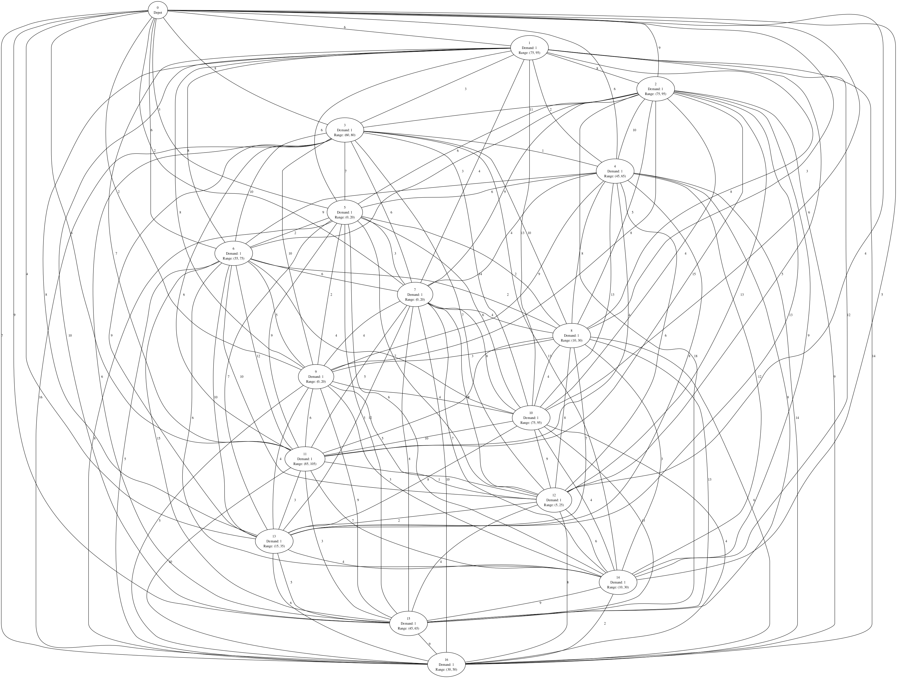
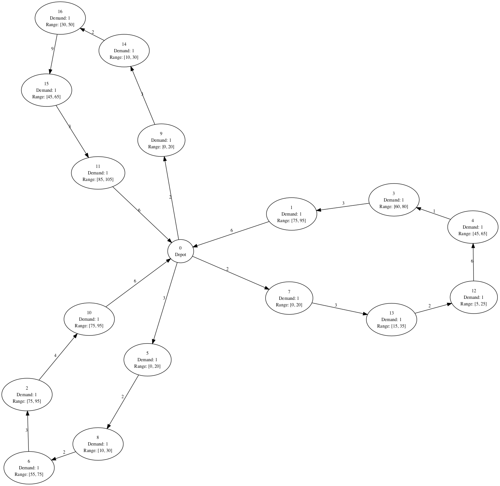

# Capacitated Vehicle Routing Problem with Time Windows (CVRPTW) solver

Capacitated Vehicle Routing Problem with Time Windows (CVRPTW) solver written in Python.

Implementation is based on ["Vehicle Routing Problem with Time Windows" section in Google OR-Tools documentation](https://developers.google.com/optimization/routing/cvrptw).


## Overview

This program solves Capacitated Vehicle Routing Problem with Time Windows (CVRPTW).

For example, given the following network and three vehicles at the depot (node 0) to pick up all demands on all nodes in as short a time period as possible,



the program provides the solution as follows:




## Prerequisites

Python 3.8 or later is required.


## Usage

First, install the dependencies:

```shell
# Install Graphviz on macOS (On other platforms, use their own package managers)
$ brew install graphviz --with-gts --with-librsvg --with-pango

# Create a Python virtual environment
$ python -m venv .venv
# Activate the virtualenv
$ source .venv/bin/activate
# Install the dependent Python modules
$ pip install -r requirements.txt
```

Alternatively, if you have `pipenv` installed, run the following command instead of the second to fourth line above:

```shell
$ pipenv install
```

Then, let's solve a sample problem!

```shell
$ ./solver.py data.sample.yaml
```

It should output the solution as follows:

```
Route for vehicle 0:
  [Node  0: Load(0) Time( 0, 0)]
  -> [Node  9: Load(0) Time( 2, 20)]
  -> [Node 14: Load(1) Time(10, 30)]
  -> [Node 16: Load(2) Time(30, 50)]
  -> [Node 15: Load(3) Time(45, 65)]
  -> [Node 11: Load(4) Time(85, 105)]
  -> [Node  0: Load(5) Time(96, 120)]
Load of the route: 5
Time of the route: 96 min

Route for vehicle 1:
  [Node  0: Load(0) Time( 0, 8)]
  -> [Node  7: Load(0) Time( 2, 10)]
  -> [Node 13: Load(1) Time(15, 18)]
  -> [Node 12: Load(2) Time(22, 25)]
  -> [Node  4: Load(3) Time(45, 65)]
  -> [Node  3: Load(4) Time(60, 80)]
  -> [Node  1: Load(5) Time(75, 95)]
  -> [Node  0: Load(6) Time(86, 120)]
Load of the route: 6
Time of the route: 86 min

Route for vehicle 2:
  [Node  0: Load(0) Time( 0, 17)]
  -> [Node  5: Load(0) Time( 3, 20)]
  -> [Node  8: Load(1) Time(10, 30)]
  -> [Node  6: Load(2) Time(55, 75)]
  -> [Node  2: Load(3) Time(75, 86)]
  -> [Node 10: Load(4) Time(84, 95)]
  -> [Node  0: Load(5) Time(95, 120)]
Load of the route: 5
Time of the route: 95 min

Total time of all routes: 277 min
```

In addition, if you want to export images of the network and routes, use `-g/--graph` option:

```shell
$ ./solver.py --graph data.sample.yaml
```

It also generates `network.png` and `route.png` for vizualizing the network and the routes of vehicles.

`data.sample.yaml` is just sample data of a problem, so if you want to solve your own, copy `data.sample.yaml` and create your own `data.yaml`! 💪
